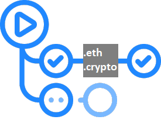

# ddns-action
DDNS(Distributed Domain Name System) update action. Currently it supports ENS and CNS.

<p align="center">
  
</p>

## Inputs
Parameter     |Required |Description
---           |---      |---
`mnemonic`    |Yes      |Mnemonic phrase for wallet recovery. Plain PrivateKey can be used as well.
`rpc`         |Yes      |Url of RPC APIs.
`name`        |Yes      |Distributed domain name. Currently it supports ENS, CNS (.eth, .crypto) names. (eg `ddns-action.eth`, `ddns-action.crypto`)
`contentHash` |Yes      |Hash of content. Currently it supports **IPFS** hash only.
`verbose`     |No       |Level of verbosity [`false` - quiet, `true` - verbose]. Default `false`

## Example usage

```
uses: aquiladev/ddns-action@v1
with:
  mnemonic: ${{ secrets.MNEMONIC }}
  rpc: ${{ secrets.RPC }}
  name: ddns-action.eth
  contentHash: ${{ steps.upload.outputs.hash }}
```

## [Documentation](https://github.com/aquiladev/ddns-action/wiki)